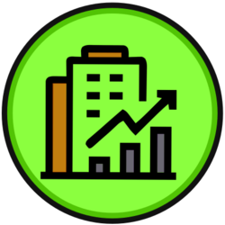

# Fundi

CSC207 final Project.
By Aaron Avram, Daniel Morgan, Krish Patel, Abdallah Arham Wajid Mohammed, and Varak Tanashian



## Setup

### Requirements

The following are required to build and run:

- **Java Development Kit (JDK) 17 or newer**
  - Ensure that Java is installed.
  - Ensure `JAVA_HOME` environment variable is set. Sometimes done automatically sometimes not.
- **Maven 3.8 or higher**
  - For building the project.
- **SQLite JDBC driver**
  - Automatically downloaded via Maven (no manual installation required).
- **

### Running the Application

From the main directory,

1. Run the following to compile to a jar:

    ```powershell
    mvn package
    ```

2. Run the following to ensure dependencies are installed correctly:

    ```powershell
    mvn dependency:copy-dependencies
    ```

3. Run the following to run the program (Windows):

    ```powershell
    java -cp "target/fundi-1.0-SNAPSHOT.jar;target/dependency/*" app.Main
    ```

   For Mac/Linux, use a colon (:) instead of a semicolon (;):

    ```bash
    java -cp "target/fundi-1.0-SNAPSHOT.jar:target/dependency/*" app.Main
    ```

- Note: Only need to run steps 1 and 2 once.

- For now (developers), the following command will re-compile and run the app in one step (Windows):

```powershell
mvn package; mvn dependency:copy-dependencies; java -cp "target/fundi-1.0-SNAPSHOT.jar;target/dependency/*" app.Main;
```

For Mac/Linux:

```bash
mvn package && mvn dependency:copy-dependencies && java -cp "target/fundi-1.0-SNAPSHOT.jar:target/dependency/*" app.Main
```

---

**Troubleshooting:**

- If you see `Error: Could not find or load main class app.Main`, ensure:
  - The `Main.java` file is in the `app` package and the first line is `package app;`.
  - The compiled JAR contains `app/Main.class`.
  - You are using the correct classpath separator for your OS (see above).

## Accessibility Report 

Fundi Web Solutions | Daniel Varak Krish Aaron Arham 

### Universal Design Principles 

#### Equitable Use 

We give all users the same ability to secure their account through our password system. We don’t have different types or tiers of users; they are all given the same complete set of features. Users can opt into sharing their portfolios by exporting their dashboard. 

#### Flexibility In Use 

We provide currency conversions which enable people of different origins to interact with our systems seamlessly. We also support trading of stocks across NASDAQ, NYSE, AMEX, TSX, and more. This means our software supports managing investments across a wide range of regions and sectors. 

#### Simple and Intuitive Use 

Our software requires no advanced technical knowledge to operate. We follow standard interface designs like tabs, buttons, visual graphs, etc. All our figures are labelled and colour coded with a legend. 

#### Perceptible Information 

We use several methods to communicate data to the user. First, we provide a numeric breakdown of the transaction history, stock price and portfolio value. We also provide this data in a visually accessible line graph in the watchlist and dashboard for easy access. We ensure text is legible and high contrast. 

#### Tolerance for Error 

Our system operates exclusively with paper trading. No real money is spent which means there are essentially no risks in using our platform. We also allow users to change their password to become more tolerant of security issues or erroneous inputs. 

#### Low Physical Effort 

Our system can be used wherever (and whenever) Java runs. This means the user can choose when to use our software. This allows the user to prevent the effects of extended computer use (eye strain, dehydration, etc) by working on a schedule that they chose to be healthy and maintainable. 

#### Size and Space for Approach and Use 

We delegate this responsibility to user’s choice of computer, computer peripherals and software accessibility devices. Therefore, this principle does not apply to our project. 

### Intended Audience 

Our software is marketed towards people who are interested in learning more about investing and the stock market, but who do not want to take on the risk and potential financial burden of investing in a real market. By removing the risk associated with investing, we open an otherwise difficult to access field to a much broader audience of students, researchers, and future investors. Using traditional tools, it can take years to build up experience investing in the stock market, often requiring thousands of dollars. Fundi allows users to experiment without risking their hard-earned money. 

### Non-Target Audience 

We Acknowledge that out software is less likely to be used by certain demographic groups. This includes professionals who require higher calibre analysis and the ability to seemlessly integrate paper trading techniques with real market activity. Additionally, people with extensive stock market knowledge may be more inclined to use tools that can generate actual profit. On the other hand, people with limited knowledge of the stock market may find Fundi intimidating to use. We have designed our software to be as accessible as possible, but not all people value stock investing or economic knowledge. In the future, Fundi could look to integrate learning tools which emphasize the importance of building good financial literacy in a safe environment. 
